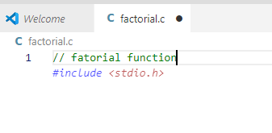
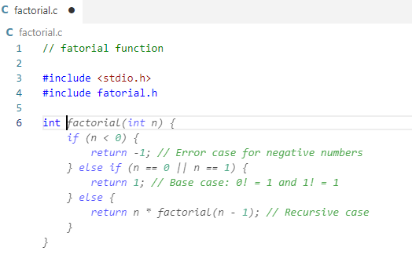
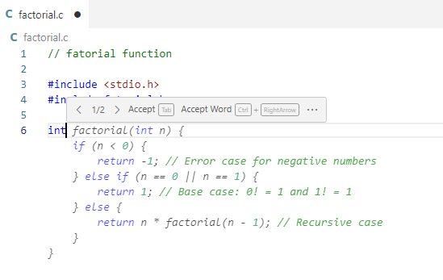
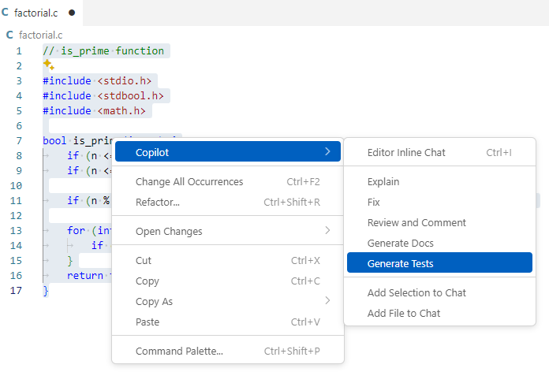
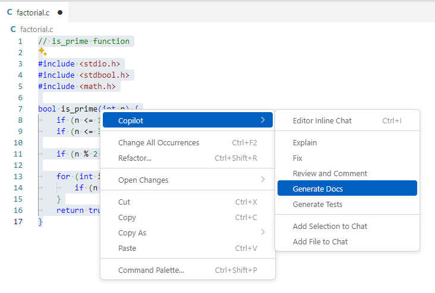

# Task 1: Get Suggestions for Simple Functions and Test Code (Code Completion)

## Use case:
- Use GitHub Copilot to get suggestions for simple functions and test code. Through this, you can learn the basic features of GitHub Copilot and see how it supports general coding tasks.

## Goal:
- Use comments to write simple functions (factorial, is_prime) using the code completion feature.
- Write test code for the created functions.
- Check the GitHub Copilot Log to see reference information if the code matches open source.
- Try changing the basic settings in the Copilot menu in VS Code.

## Step 1: Write Basic Functions
- Open VS Code and create a new file (factorial.c) 
  

- Enter the following comment. 
  `// Factorial function ` 
  

- Check the code suggested in gray and press the Tab key to complete the code. 
   

- Hover over the suggested code to see available options. 
    

- Next, enter the following comment. 
  `// Prime number check function` 

- While the code is suggested in gray (without accepting the code), press `Ctrl + Enter` to see the list of suggestions. 
  

- When receiving suggestions for '`// Prime number check function`', select the `GitHub Copilot Log` in the `OUTPUT` tab from the command line to check the reference information for open source. 
  

## Step 2: Use the Right-Click Copilot Menu
- Right-click and select 'generate_test' from the 'Copilot' menu. 
    

- Right-click and select 'generate_docs' from the 'Copilot' menu. 
    
    

## Step 3: Understanding the Context of Code Completion
- Copilot understands the context for code completion based on **comments and function names**. 
- It also understands the context by looking for **data before and after the cursor position** in the current file and similar data in **neighboring open tabs**. (**Neighboring Tab**) 
- For C/C++, GitHub Copilot's code completion goes a step further and automatically uses directly referenced header files as context, even if the header files are not open. ([Blog article link](https://github.blog/changelog/2024-08-01-improving-github-copilot-completions-in-vs-code-for-c-developers/))

   - To test context delivery in code completion, follow the steps below.
   - Copy the contents of the `url_tools.c`, `url_tools.h`, `url.c`, and `url.h` files from the `/src` directory to your current workspace. 
      
      

   - Close the header files, and when you press Enter at the last line of a function in `url.c`, you will see suggestions for functions from url_tools.c as shown below. 
     

## Step 4: Copilot Settings Menu in VS Code
- Press Ctrl + Shift + P in VS Code to open the command palette, search for 'preference', and select `Preference: Open Settings (UI)`. 
    
- Search for Copilot locale and change it to 'ko'. 
    

- Try changing the default model for code completion. 
  - Click the Copilot icon at the top and select `Configure Code completion`. 
    
  - Select 'Change completion model'. 
    
  - Change the model. 
    

- Try enabling/disabling the experimental feature `NES(Next Edit Suggestion)`. 
    

- Reference: [VS Code Copilot settings reference documentation](https://code.visualstudio.com/docs/copilot/copilot-settings)

## Knowledge Check
- GitHub Copilot's code completion feature
- Model selection for code completion
- Context for GitHub Copilot's code completion feature
- Copilot settings menu in VS Code

