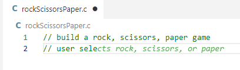
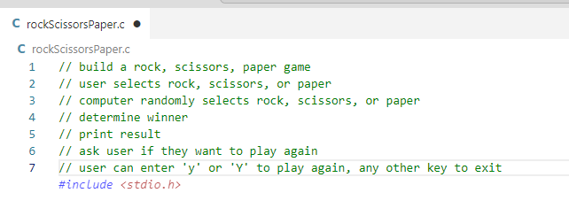
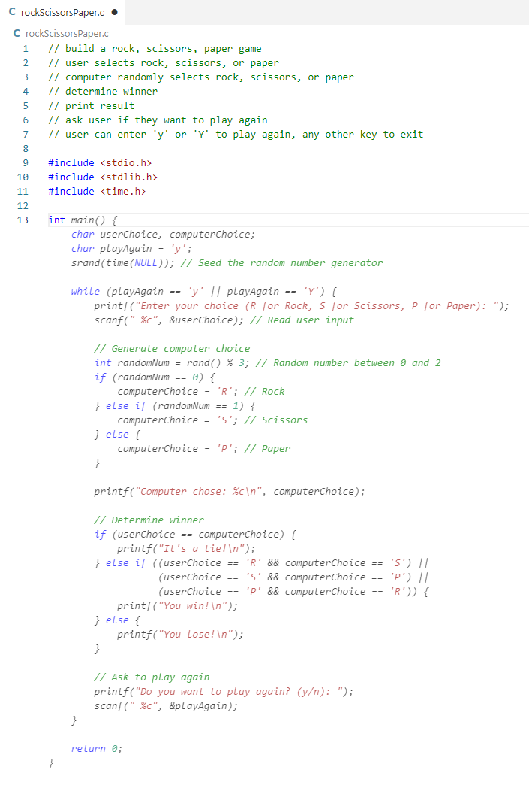
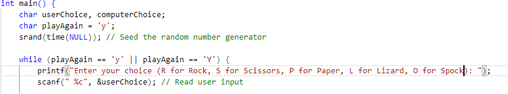
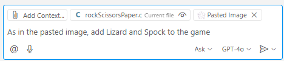

# Task 2: Create a Rock, Paper, Scissors Game (Using Copilot Chat)

## Use case:
- Use GitHub Copilot to create a Rock, Paper, Scissors game and add additional game logic to the basic game, increasing the utilization of Copilot through hands-on practice.

## Goal:
- Create a Rock, Paper, Scissors game.
- Run the game and print the game results.
- In addition to the basic Rock, Paper, Scissors game, add extended versions such as Lizard and Spock.
- Use the `Vision` feature of Copilot Chat to paste an image file and get code suggestions based on it.
- Use the `Review and Comment` feature of Copilot Chat to get a review of your code.
- Provide custom instructions to `Review and Comment` to receive reviews in your desired format.

## Step 1
- Use Copilot Chat to request code that can create a Rock, Paper, Scissors game.
- Add logic for the user to select one of rock, paper, or scissors and play against the computer.
- Add logic to compare the user's choice and the computer's choice to determine the winner.
- Add logic to allow the user to choose whether to continue or end the game. 
    
    

- Check the code suggested by Copilot. 
    

- After compiling, run the game and check the output. 
    

## Step 2: Add Lizard, Spock
- Use Copilot to add logic for Lizard and Spock to the created game. 
    
- Add Lizard and Spock to the `choices` list. 
     

- Copy the image file above and paste it into Copilot Chat. 
     
     

- Check that there is a 'Pasted Image' in Copilot Chat. 
     

- In Copilot Chat, request "Please add Lizard and Spock according to the image file". 
     

- Check the code suggested by Copilot Chat. 
     

- Click the `Apply to file` button in Copilot Chat to apply the suggested code. 
     
     

- Click Keep to keep the changes and press `Ctrl+S` to save. 
     

- If necessary, add any missing code and run it. 
     

## Step 3: Try Using Review and Comment
- Right-click and use the `Review and Comment` feature to get a review of your code. 
     

     

- Set up `Custom instructions` for `Review and Comment` as follows: 
  - Press `Ctrl + Shift + P` to open the command palette. 
  - Select `Workspace settings(JSON)`. 
     

  - Add the following option to the JSON file and enter as in the example below. 
    - `"github.copilot.chat.reviewSelection.instructions"` 
     
    - `"Function names start with '_', and variable naming follows the same rule. Use PascalCase for class and constructor names. Use 2 spaces for indentation."` 

   - Use the `Review and Comment` feature again to get a review of your code. 
     

## Knowledge Check:
- The difference between code completion and Copilot Chat features
- Other possible uses of the Vision feature
- How to use Copilot Chat's `Review and Comment` feature and custom instructions to get reviews in your desired format