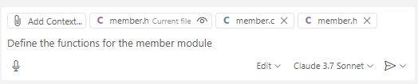

# Task 3: Build a Library Loan Management Program (Part 1)

## Use case:
- Provide custom instructions to Copilot to receive code suggestions in your desired format.
- Use various modes of Copilot Chat (Ask, Edit, Agent) to build the program.

## Goal:
- Learn how to utilize various features of GitHub Copilot by building a real library loan management program.
- Try using models other than the default GPT-4o model.
- Learn how to provide custom instructions to Copilot to get code suggestions in your desired format.
- Use Copilot Chat's 'Ask', 'Edit', and 'Agent' modes to build modules and understand the differences.

## Step 1: Create Custom Instructions
 - **[What are Custom Instructions?](https://code.visualstudio.com/docs/copilot/copilot-customization)**
    - A way to provide specific context to Copilot to receive code suggestions in your desired format.
    - For example, use it when you want code suggestions in a specific style or language.
    - Custom instructions can be written in various forms.

      - [Write as a .github/copilot-instructions.md file](https://docs.github.com/en/enterprise-cloud@latest/copilot/customizing-copilot/adding-repository-custom-instructions-for-github-copilot?tool=vscode) <br>
         - Enable the relevant setting in VS Code settings <br>
          
          <br>
         - Write [Copilot instructions](src/copilot-instructions.md).  <br>
          

      - You can also write them as text or file format in the User or Workspace settings JSON file in VS Code, which is added to the settings.json file.

          - Create a `/docs` directory in your project.
          - Copy the files from the example `/docs` directory and paste them into your current project.<br>
            
          - Check the contents of the pasted files and modify them if you want.

          - Press `Ctrl + Shift + P` to open the command palette and select `Preference: Open Workspace Settings (JSON)`.<br>
            

          - Add "github.copilot.chat.codeGeneration.instructions" to the settings.json file.<br>
          ```json
          {
            "github.copilot.chat.codeGeneration.instructions": [
                  {
                      "file": "docs/spec.md"
                  },
                  {
                      "file": "docs/C-style.md"
                  },
                  {
                      "file": "docs/database-style.md"
                  },
                  {
                      "file": "docs/test-style.md"
                  }
              ]
          }
          ```
    
- Ask Copilot Chat "How should I structure this project?" and check if the custom instruction files are referenced.<br>
   

## Step 2: Request a Program Structure Diagram

- Change the model. Select the `Claude 3.7 Sonnet` model.<br>

- Ask "Please generate a diagram for this project" to check the project structure.<br>
  
  
  

## Step 3: Create the database module

- First, create an `include` directory and a `database.h` file.<br>
- In Copilot Chat's `Ask` mode, request "Declare the functions in the database header file".<br>
  

- Check the suggestions and add them to the file.<br>
  

- Create a `src` directory and a `database.c` file.<br>
- In Copilot Chat, request "Define the functions in the database source file" and drag the previously created `database.h` file into the chat.<br>
  

- Check the suggestions and add them to the file.<br>

## Step 4: Create the Book module

- Next, create the Book, Member, and Loan modules in order.<br>
  
- In the `include` directory, create a `book.h` file.<br>

- In Copilot Chat's `Ask` mode, request "Declare the functions in the Book header file".<br>
  
- Check the suggestions and add them to the file.<br>
  

- In the `src` directory, create a `book.c` file.<br>
- In Copilot Chat, request "Define the functions in the Book source file" and drag the previously created `book.h` file into the chat.<br>

- Check the suggestions and add them to the file.<br>
  

## Step 5: Create the Member module

- This time, use <span style="color:red">**Copilot Edit**</span> to create both the Member header and source files at once.<br>
  
- Create `member.h` and `member.c` files.<br>

- Switch Copilot Chat to `Edit` mode.<br>
  

- Drag `member.h` and `member.c` into the chat.<br>

- In the chat, request "Define the functions for the member module".<br>
  

- Copilot Edit will automatically write code to the files.<br>
  

- Check/modify the code in the files as needed and click 'Keep' to save the changes.<br>
  

- Save the changed files.<br>
  
## Step 6: Create the Loan module

- This time, use <span style="color:red">**Copilot Agent**</span> to create both the Loan header and source files at once.<br>

- Switch Copilot Chat to 'Agent' mode.<br>
  

- In Agent mode, request "Create the Loan module" or similar.<br>
  

- Check and modify the generated Loan module as needed.<br>
  

- Save the changed files.<br>

## Step 7: Create the main function

- This time, use the `#` keyword in Agent mode to utilize the **`#codebase`** feature.<br>

  - [`#codebase` is a feature that lets Copilot automatically find and add relevant files from the codebase to the chat, instead of adding files manually.](https://code.visualstudio.com/docs/copilot/chat/copilot-chat-context#_let-copilot-find-the-right-files-automatically)<br>
  - This is especially useful when you are not sure which files are relevant.<br>
   
- To use `#codebase`, press `Ctrl + Shift + P` to open the command palette, search for `codesearch` in `Preferences: Open Settings(UI)`, and make sure the checkbox is enabled.<br>
  

- In Agent mode, type `#` to see various options. Select 'codebase' from the options.<br>
  

- Request "Create the main function" to Copilot.<br>
  

- Copilot will search the codebase and generate the file and code. Check the results.<br>
  

## Step 8: Generate a Plant UML Diagram
- Select a specific function from the generated code and ask Copilot to generate a Plant UML flowchart.<br>
  
  

- Create a file for the generated Plant UML flowchart.<br>
  

- Check the flowchart.<br>
  
  

## Step 9: Create a Makefile

- In Agent mode, request "Create a Makefile".<br>
  
  

## Step 9: Save
- Press `Ctrl + Shift + P` to open the command palette and select `File: Save All Files`.<br>
  


