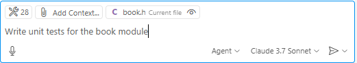
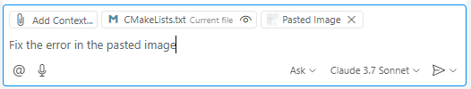

# Task 4: Build a Library Loan Management Program (Part 2)

## Use case:
- Use Copilot to generate unit test code for the library loan management program created in Part 1, troubleshoot errors during testing with Copilot, use Copilot from the CLI, or automatically generate commit messages.

## Goal:
- Generate unit tests using Google Test.
- Learn various ways to provide context to Copilot for troubleshooting errors: #terminalSelection, #file, #selection
- Learn how to use Copilot from the CLI command window.
- Learn how to use the automatic commit message generation feature and how to generate commit messages in your desired format using custom instructions.

## Step 1: Generate Unit Tests

- Use Agent to write unit tests for each module and verify the operation of each function.<br>

- "Write unit tests for the book module."<br>
  

- Two options are suggested.<br>
  - Option 1: Add a test target to the Makefile<br>
  

  - Option 2: Create a CMakeLists.txt<br>
  

- Proceed with Option 2 and create the CMakeLists.txt file.<br>
  

- Check the generated contents for the book module.<br>
   

## Step 2: Use Copilot in the CLI Terminal: Ask Copilot for the Test Execution Command
- In the CLI command window, ask Copilot for the test execution command.<br>

- In the CLI command window, press `Ctrl + i` to open the Copilot command window.<br>
  

- Enter `#file` and select the `CMakeLists.txt` file.<br>
  

- Enter "Windows command for running tests" and ask Copilot.<br>
  
  

## Step 3: After Running the Test, Ask How to Resolve Error Messages
- Run the test, and if it fails as in the example below, use a screenshot in Ask mode to ask Copilot for help with the error message.<br>
  
  

- Or, in Ask mode, select `#terminalLastCommand` to ask Copilot for help with the error message.<br>
  
  

- Check the test results.<br>
  

## Step 4: Generate Unit Tests for Other Modules
- Practice generating unit tests for other modules using Agent, just like in Step 1.<br>    

## Step 5: Automatic Commit Message Generation (Generate Commit Messages in Your Desired Format with Custom Instructions)
- Open the `.vscode/settings.json` file and enter the following:<br>
  ```json
  - "github.copilot.chat.commitMessageGeneration.instructions": [
      {
          "text" : "Write commit messages in Korean, in present tense. Summarize the changes in detail, prefix each item with '-', and include emojis."
      }
  ]
  ```
  - Save the file changes.<br>
 
- If git is not enabled, enable it, stage the changed files, and click the 'sparkle' button on the right side of the commit message input box to generate a commit message. Check if it is generated according to the instructions.

   
   

## Knowledge Check
- Various ways to provide context
- Using Copilot in the CLI command window
- Using the automatic commit message generation feature and setting instructions with custom instructions

## Additional Resources
- [How to generate unit tests with GitHub Copilot: Tips and examples](https://github.blog/ai-and-ml/github-copilot/how-to-generate-unit-tests-with-github-copilot-tips-and-examples/)