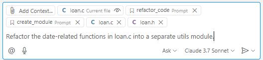
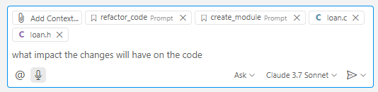

# Task 5: Using Copilot for Code Review and Refactoring

## Use case:
- Use Copilot to get a code review and perform refactoring.

## Goal:
 - Learn how to use custom instructions for code review by using a prompt file.
 - Try using questions with `@workspace`.
 - Create prompt files for code refactoring and new module creation, and request Copilot to refactor code and create new modules.

## Step 1: Create Prompt Files - Reusable Prompt Instructions

- **[What is a Prompt File?](https://code.visualstudio.com/docs/copilot/copilot-customization#_reusable-prompt-files-experimental)**
  - A prompt file allows you to save reusable prompt instructions in Markdown format, making it easy to provide additional context to Copilot. For example, you can organize specific architectural requirements or code styles in this file, and quickly call them up in the chat window to generate intended code without repetitive instructions.
  - Use cases:
    - Code generation: Create reusable prompts for components, tests, migrations, etc., such as quickly generating React forms or API mockups.
    - Domain expertise: Share specialized knowledge as prompts, such as security policies or compliance checks.
    - Team collaboration: Record patterns and guidelines by referencing documents or specifications.
    - Onboarding: Create step-by-step guides for complex processes or project-specific patterns.

- Check the Prompt Files section in VS Code settings. 
    
    

- Create the default `.github/prompts` directory. 
    

- In this directory, paste the contents of the [code_review.prompt.md](src/prompt/code_review.prompt.md), [refactor_code.prompt.md](src/prompt/refactor_code.prompt.md), and [create_module.prompt.md](src/prompt/create_module.prompt.md) files from the example `src/prompt` directory in the workshop repository. 
    

## Step 2: Use Prompt Files to Refactor Example Code
- Open the `loan.c` and `loan.h` files in the `src` directory and request refactoring to separate common functions into `utils.c` and `utils.h`. 
- Freely use `Agent`, `Edit`, or `Ask` modes. 
- Drag and drop the `loan.c` and `loan.h` files into Copilot Chat. 
  
- In the chat window, click the paperclip icon and select the prompt files (refactor_code.prompt.md, create_module.prompt.md). 
  

- Request refactoring to separate date-related functions. 
  

- Example prompt: "Refactor the date-related functions in loan.c into a separate utils module."

- Check the suggested content and improved code. 
  

## Step 3: Ask Copilot About the Impact of Changes

- Ask Copilot what impact the code changes from refactoring will have on other parts of the code and get suggestions for related code. 

- Switch to Copilot `Ask` mode. 
  
- In Copilot chat, type `@workspace` and ask what impact the changes will have on the code. 
  

- Note: `@workspace` in Ask mode searches for related files and symbols across the entire codebase based on your question and references them in the answer.
  - [VS Code @workspace documentation](https://code.visualstudio.com/docs/copilot/reference/workspace-context)

  - @workspace
    - First, @workspace identifies the information needed to answer the user's question. This includes chat history, workspace structure, currently selected code, etc.
    - Next, it collects context in various ways. It finds relevant code snippets through local search or GitHub code search, or uses VS Code's language IntelliSense to add details such as function signatures and parameters.
    - Finally, this context is used by GitHub Copilot to answer the question. If the context is too large, only the most relevant parts are used. The response includes references to files, file ranges, and symbols, allowing you to directly link to that information in the codebase from the chat response. The code snippets provided to Copilot are listed as references in the response.
    
  - Sources used by `@workspace`:
    - All [indexable files](https://code.visualstudio.com/docs/copilot/reference/workspace-context#_what-content-is-included-in-the-workspace-index) in the workspace, except for files ignored by a .gitignore file
    - Directory structure with nested folder and file names
    - GitHub's code search index, if the workspace is a GitHub repository and indexed by code search
    - Symbols and definitions in the workspace
    - Currently selected text or visible text in the active editor

  - With `@workspace`, you can:
    - Search code
    - Plan for complex code edits
    - Ask high-level questions about the structure or implemented features of the codebase

- Check Copilot's suggestions. 
  
  

## Step 4: Request Refactoring from a Performance Perspective
- Open the `getDiscount.c` file in the `src` directory and request refactoring from a performance perspective. 
- Freely use `Agent`, `Edit`, or `Ask` modes. 
- In Chat, type `#file` and select the `getDiscount.c` file. 

- Example prompt: "Suggest improvements from a performance perspective for this file." 

- Check the suggested content and improved code. 
  

## Step 5: Request Improvements for Security Issues

- Open the `vulnerable_server.c` file in the `src` directory, check for security issues, and request improvements. 
- Freely use `Agent`, `Edit`, or `Ask` modes. 
- In Chat, type `#file` and select the `vulnerable_server.c` file. 

- Example prompt: "Analyze the security issues in this file and suggest improvements."

- Check the suggested content and improved code. 
  

## Step 6: Request a Code Review Using Prompt Files
- Request a code review for the generated code using a prompt file. 
- You can use any of `Agent`, `Edit`, or `Ask` modes, but select Ask mode for the question. 
- In the chat window, click the paperclip icon, select Prompt, and choose the code_review.prompt.md file. 
  
  
- Without entering a prompt, simply click the arrow button to request.
  

- Check the suggested content and improved code. 
  
  

## Additional Resources
  - [Guide to using GitHub Copilot in various ways](https://docs.github.com/ko/enterprise-cloud@latest/copilot/using-github-copilot/guides-on-using-github-copilot)
  - [How to refactor code with GitHub Copilot](https://github.blog/ai-and-ml/github-copilot/how-to-refactor-code-with-github-copilot/)
  - [How to debug code with GitHub Copilot](https://github.blog/ai-and-ml/github-copilot/how-to-debug-code-with-github-copilot/)
  - [10 Unexpected Ways to Use Github Copilot](https://github.blog/2024-01-22-10-unexpected-ways-to-use-github-copilot/)

## Knowledge Check
- Refactoring with Copilot
- Using `@workspace`
- Using prompt files

